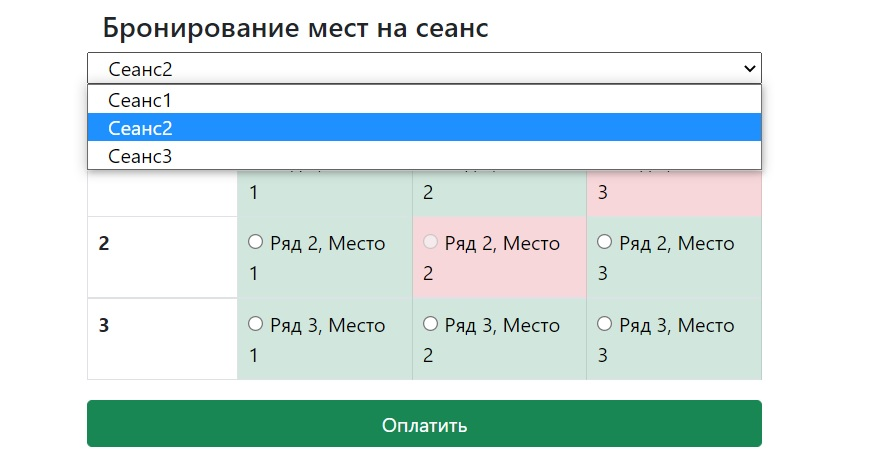
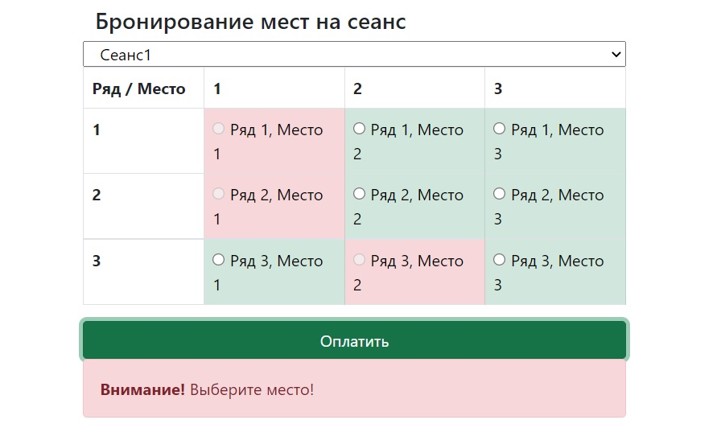
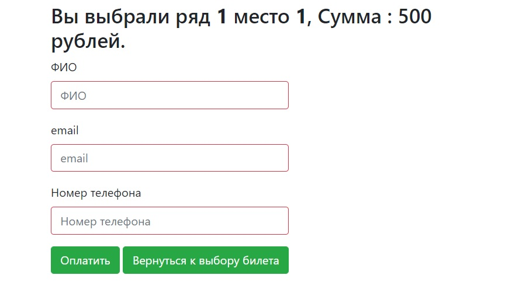
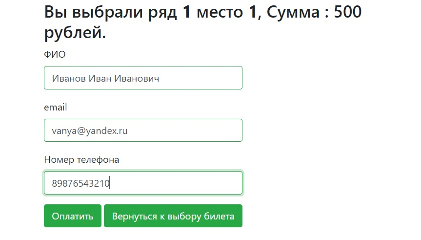
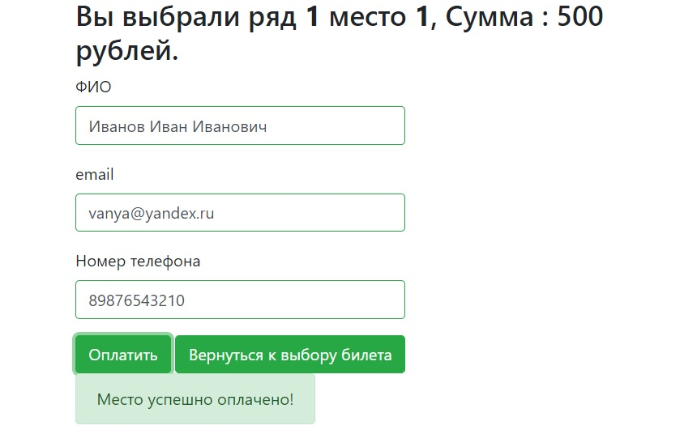

# job4j_cinema

#### Сервис продажи билетов для киноеатра
- Отображение занятых и свободных мест
- Блокировка для выбора занятых мест
- Покупка билета, создание аккаунта для покупателя
- Проверка места во время оплаты

#### Используемые технологии  
- JDBC (PostgreSQL)
- JAVA servlets/JSTL
- Bootstrap
- JS/jQuery/AJAX
- Slf4j
- Travis CI

#### Интерфейс
- Главная страница:

- Место не выбрано:

- Пустая форма с проверкой заполнения:

- Заполненная форма оплаты:

- Корректная оплата:

